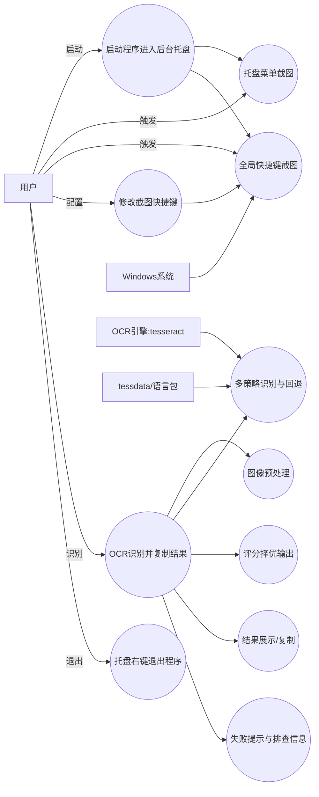
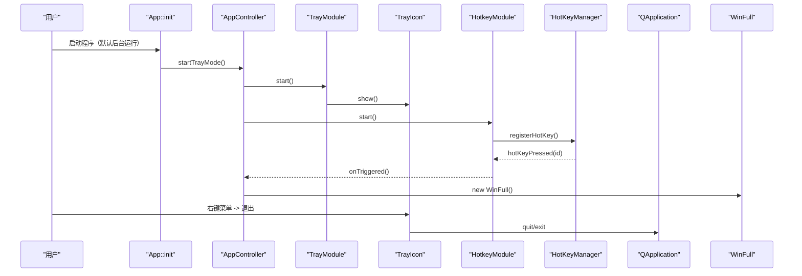
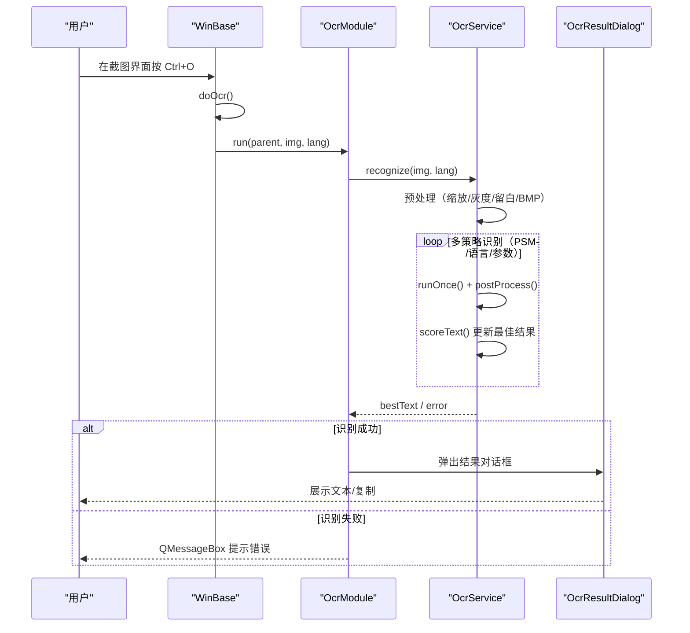
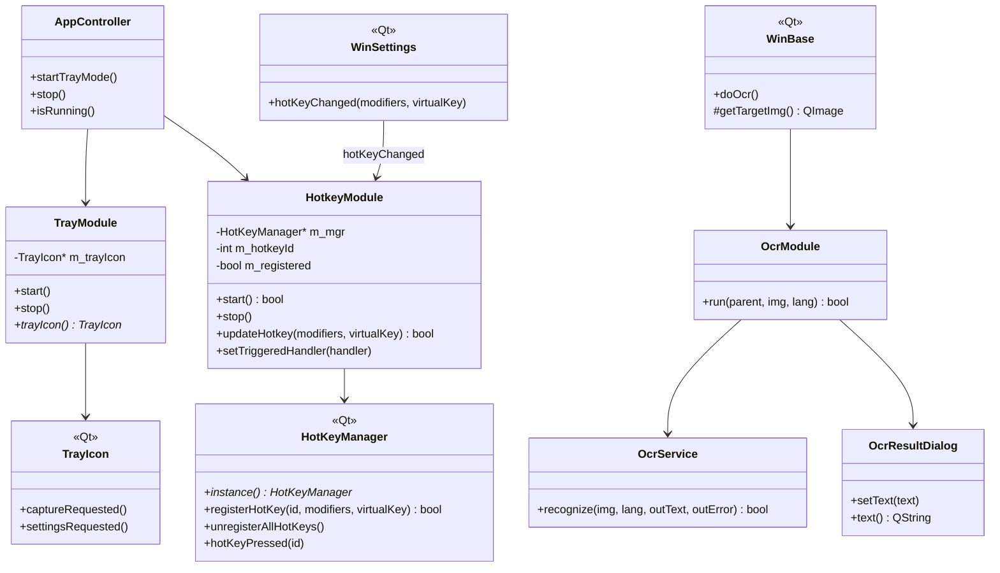

# 团队新功能开发文档：后台托盘运行 + 全局热键 + OCR（模块化集成）

## 1. 新增功能概述（相对原系统）

本次团队在原有 ScreenCapture 截图系统基础上，新增/完善并完成模块化集成的功能包括：

- **后台运行（托盘模式）**
  - 程序启动后自动进入后台托盘常驻（关闭截图窗口不退出）。
  - 支持托盘图标交互（单击/双击触发截图），右键菜单（截图/设置/关于/退出）。
  - 支持托盘提示消息（例如热键注册结果）。
  - 仅可通过托盘右键菜单“退出”完全退出程序。
- **全局快捷键（系统级热键）**
  - 通过 Windows API `RegisterHotKey` 注册系统级快捷键。
  - 默认快捷键：`Ctrl+Alt+A`，并支持在设置窗口中修改。
  - 通过隐藏窗口接收 `WM_HOTKEY` 消息并触发截图。
 - **OCR 文字识别**
   - 在截图窗口中触发 OCR（如 `Ctrl+O`），对当前截图区域进行文字识别。
   - 调用 tesseract（外部进程）完成识别，弹出结果对话框并支持复制。
   - 识别前会进行基础预处理以提升速度与准确率：
     - 图片过小会适当放大、过大会做像素上限控制，避免识别耗时过长。
     - 灰度化 + 增加边距（留白），降低噪声与贴边裁切导致的漏识别。
     - 使用 BMP（无压缩）作为中间格式，避免压缩噪声和解码耗时。
     - 采取多种识别策略并自动回退：优先使用混合语言（如 `chi_sim+eng`），质量不理想时回退到中文单语言；在疑似“代码/路径”文本场景下额外尝试英文+白名单策略。
     - 通过 `scoreText()` 对识别结果评分，选出最优策略输出。

---

## 2. 新需求模型

### 2.1 用例图（Use Case Diagram）

**文字说明：**
- **启动程序进入后台托盘**：程序启动后自动常驻系统托盘，关闭截图窗口不退出。
- **托盘菜单截图**：用户从托盘菜单选择“截图”或单击/双击托盘图标触发截图。
- **全局快捷键截图**：程序在后台运行时仍可响应系统级热键并触发截图。
- **OCR识别并复制结果**：用户在截图界面触发 OCR，对选区图像进行文字识别，并复制文本；识别前会进行图像预处理、多策略识别与回退、评分择优输出、结果展示/复制、失败提示与排查信息。

---

### 2.2 交互图 1：托盘模式启动与热键触发截图（Sequence Diagram）

**文字说明：**
- `AppController::startTrayMode()` 是托盘/热键模块的集成入口。
- `TrayModule` 负责托盘图标生命周期管理.
- `HotkeyModule` 负责加载配置并通过 `HotKeyManager` 完成系统热键注册.
- 截图窗口 `WinFull` 的创建保持与原系统一致（以最小改动融入）。

---

### 2.3 交互图 2：截图窗口触发 OCR（Sequence Diagram）

**文字说明：**
- OCR 的 UI 触发点在 `WinBase::doOcr()`；识别与展示被集中到 `Modules/Ocr` 内实现，减少窗口层逻辑复杂度.
- 识别失败会统一走错误提示，避免错误分散在多个窗口类中.

---

## 3. 新设计模型

### 3.1 新增/修改的核心类与接口（类图）

**文字说明：**
- `AppController`：作为集成层统一管理托盘与热键的启动、停止与运行状态，避免在 `App/App.cpp` 中堆积跨模块逻辑.
- `TrayModule / HotkeyModule / OcrModule`：以“模块”为单位封装功能入口，内部持有实现类，减少耦合.
- `HotKeyManager`：保留与 Windows 消息循环的对接（接收 `WM_HOTKEY`），上层由 `HotkeyModule` 统一管理配置与生命周期.

---

### 3.2 配置/数据结构（数据表/配置项）

 本项目未引入独立数据库，本次功能主要新增/依赖的持久化配置项为 `QSettings`（键值型配置，类似“轻量数据表”）：

- **配置域**：`("ScreenCapture", "Settings")`
- **落盘位置**：未显式指定 `IniFormat`，默认使用 `QSettings::NativeFormat`，通常保存到注册表。

#### 3.2.1 配置项清单（Key / 类型 / 默认值）

| Key | 类型 | 默认值 | 用途 |
|---|---|---|---|
| `HotKey/Modifiers` | `int` | `MOD_CONTROL | MOD_ALT` | 全局热键修饰键组合 |
| `HotKey/VirtualKey` | `int` | `int('A')` | 全局热键主键（Windows VK） |
| `General/AutoStart` | `bool` | `false` | 是否开机自启动（由设置界面保存） |
| `General/ShowTrayMessage` | `bool` | `true` | 是否显示托盘提示消息 |

#### 3.2.2 读写位置与生效时机（对应代码）

- **写入（保存）**：`Win/WinSettings.cpp`
  - `WinSettings::saveSettings()` 写入上述 Key，并调用 `settings.sync()` 确保持久化。
- **读取（加载）**：
  - `Win/WinSettings.cpp`：`WinSettings::loadSettings()` 用于设置窗口初始化显示。
  - `Modules/Hotkey/HotkeyModule.cpp`：`HotkeyModule::loadAndRegister()` 在后台模式启动时读取热键配置并注册。
  - `Modules/Tray/TrayIcon.cpp`：托盘对象内部持有同域 `QSettings` 用于展示/同步热键相关信息。
- **热键即时生效**：设置窗口保存后触发 `WinSettings::hotKeyChanged(modifiers, virtualKey)`，由 `HotkeyModule::updateHotkey()` 重新注册热键，避免重启程序才能生效。

---

## 4. 集成方案

### 4.1 如何融入现有系统

- **托盘/热键集成入口**
  - 通过 `Modules/Integration/AppController::startTrayMode()` 启动托盘与热键.
  - 保持截图窗口创建方式不变：仍由 `new WinFull()` 创建，最大程度复用原有截图功能.

- **OCR 集成入口**
  - `WinBase::doOcr()` 不直接拼装识别流程，而是委托给 `OcrModule::run()`.
  - `OcrModule` 内部统一负责：调用 `OcrService` 识别 + 打开 `OcrResultDialog` 展示结果.

### 4.2 对原有模块的影响评估

- **对截图核心（Win/Canvas/Shape/Tool）影响**：
  - 影响较小，截图流程本身不变.
  - OCR 仅在用户触发时执行，属于新增能力.
- **对 App 层影响**：
  - 将托盘/热键的跨模块逻辑集中到 `AppController`，降低 `App/App.cpp` 的复杂度.
- **对构建系统影响（Visual Studio 工程）**：
  - 新增 `Modules/*` 下实现文件加入编译.

## 5. 团队分工表与其他情况说明

### 5.1 团队分工表

| 成员 | 负责模块/功能 | 具体任务 | 产出物 |
|---|---|---|---|
| 成员A（例：张三） | 托盘模块 | 托盘图标交互、菜单项、托盘消息、与截图/设置事件对接 | `Modules/Tray/*` |
| 成员B（例：李四） | 热键模块 | Windows 热键注册/注销、配置加载、与设置窗口联动 | `Modules/Hotkey/*` |
| 成员C（你） | OCR 模块 | OCR 模块分层设计（`WinBase` 触发 / `OcrModule` 编排 / `OcrService` 执行）；图像预处理与识别质量优化（缩放、灰度化、留白、格式选择）；性能优化方案沉淀（异步化、缓存、参数调优、耗时统计）；解决中英混合导致识别质量极差及识别时间过长的问题。 | `Modules/Ocr/*` |
| 成员D（可选） | 集成与工程 | `AppController` 集成、`.vcxproj/.filters` 维护、编译验证 | `Modules/Integration/*`，构建变更记录 |

### 5.2 项目代码托管地址

- （按你要求此处可先不填写）

### 5.3 项目提交记录

- 可用文档形式记录关键变更：
  - `Doc/变更记录-后台模式逐行.md`（逐行变更说明）

### 5.4 其他情况说明

- **兼容性**：托盘与热键依赖 Windows API，目标系统为 Windows 10/11.
- **外部依赖**：OCR 依赖 tesseract，已通过程序目录捆绑该可执行文件.
- **风险点**：热键可能与其他程序冲突导致注册失败

---

## 6. 附录：关键文件列表（便于验收）

- **新增的模块文件**
  - `Modules/Tray/TrayModule.*`
  - `Modules/Tray/TrayIcon.*`
  - `Modules/Hotkey/HotkeyModule.*`
  - `Modules/Hotkey/HotKeyManager.*`
  - `Modules/Ocr/OcrModule.*`
  - `Modules/Ocr/OcrService.*`
  - `Modules/Ocr/OcrResultDialog.*`
  - `Modules/Integration/AppController.*`
