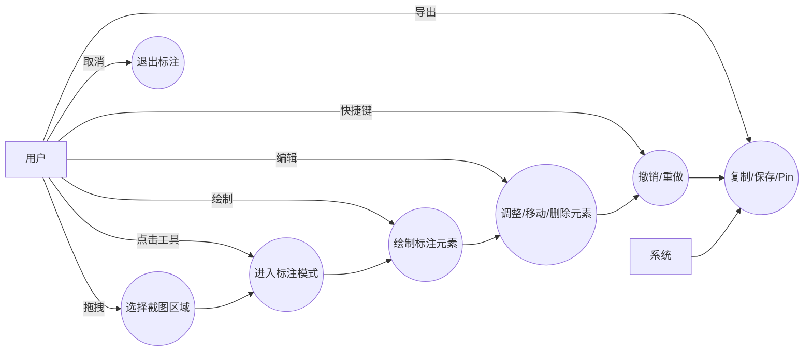
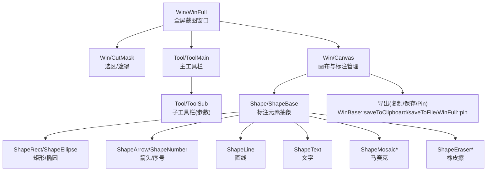
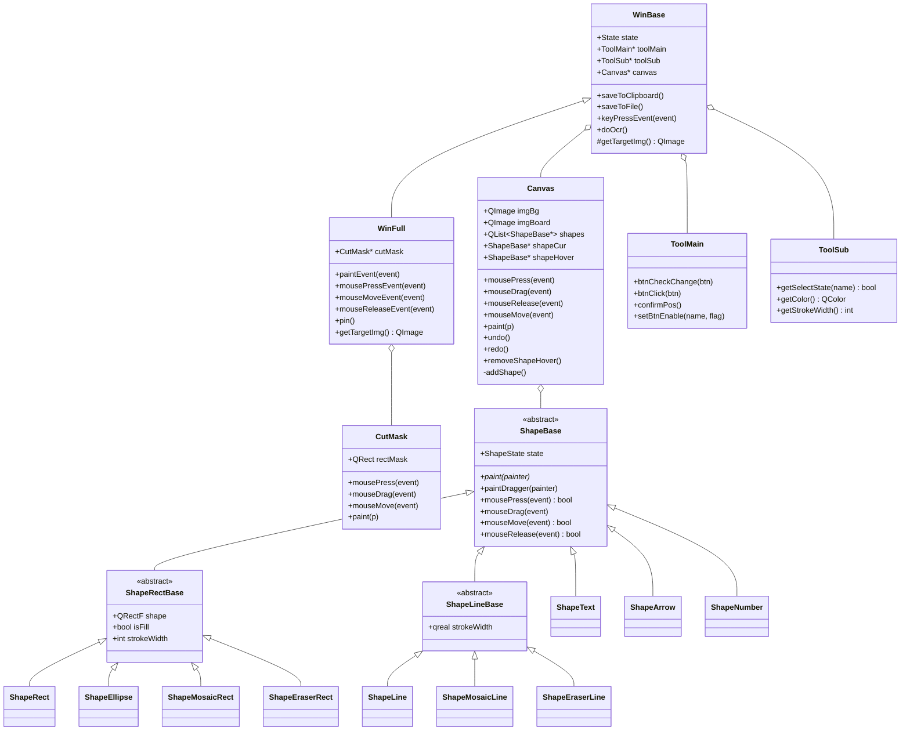
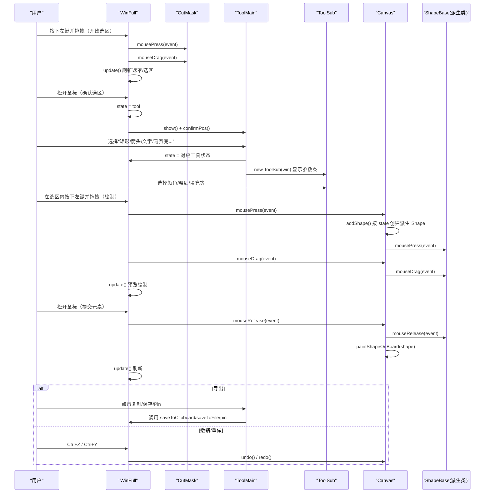

# 技术文档：截图标注功能模块（Canvas/Tool/Shape）

## 0. 范围与目标

本文档说明 ScreenCapture 工程中“截图标注（绘制）”功能模块的需求模型与软件设计模型。

- **模块范围**：用户在截图后，对选区进行矩形/椭圆/箭头/编号/画线/文字/马赛克/橡皮擦等标注，并支持撤销/重做、复制/保存、Pin。

## 1. 需求模型

### 1.1 核心功能列表（Functional Requirements）

- **FR-1 选区截图**：用户拖拽选择屏幕区域作为截图/标注目标。
- **FR-2 进入标注模式**：选择完选区后显示主工具栏，进入标注状态。
- **FR-3 绘制标注元素**：支持绘制以下标注元素：
  - 矩形（可填充/描边）
  - 椭圆（可填充/描边）
  - 箭头
  - 序号标注（数字）
  - 画线（支持透明度选项）
  - 文字（支持粗体/斜体/字号/颜色等）
  - 马赛克（矩形填充/路径涂抹）
  - 橡皮擦（矩形填充/路径擦除）
- **FR-4 元素编辑与删除**：鼠标悬停时显示拖拽点（dragger），支持移动/缩放；支持 `Delete/Backspace` 删除悬停元素。
- **FR-5 撤销/重做**：支持 `Ctrl+Z` 撤销、`Ctrl+Y` 重做。
- **FR-6 输出**：
  - 复制到剪贴板（双击/快捷键/按钮）
  - 保存到文件
  - Pin（置顶窗口展示）
- **FR-7 快捷键支持**：标注窗口内支持快捷键触发撤销/重做/保存/复制/退出等。

### 1.2 用户角色与交互场景

- **角色：普通用户**
  - 在截图时选择区域，并进行标注、导出。

### 1.3 用例图（Use Case Diagram）

**文字说明：**
- **选择截图区域**：在全屏截图窗口中通过拖拽生成选区（截图矩形）。
- **进入标注模式**：选区确认后出现主工具栏，用户选择具体标注工具。
- **绘制标注元素**：根据工具类型在画布上创建对应 `Shape` 对象，并在拖拽过程中预览。
- **调整/移动/删除元素**：对已创建元素通过拖拽点进行缩放/移动，或用按键删除。
- **撤销/重做**：对标注元素的“显示状态”进行 undo/redo 管理，并刷新合成画布。
- **复制/保存/Pin**：将背景截图与标注层合成后导出到剪贴板/文件，或生成 Pin 窗口。

### 1.4 非功能性需求（Non-Functional Requirements）

- **NFR-性能**
  - 标注拖拽与预览应保持流畅（典型场景 60 FPS 体验），避免每次鼠标移动都对全量图像做高成本重算。
  - 撤销/重做操作的重绘应在可接受时间内完成（与元素数量线性相关）。

- **NFR-可用性**
  - 工具栏定位应尽量不遮挡用户选区。
  - 提供键盘快捷键（`Ctrl+Z/Y/S/C` 等）以提高效率。

- **NFR-稳定性**
  - 在频繁创建/撤销/删除元素时不应发生崩溃或内存泄漏（元素生命周期应统一由 `Canvas` 管理）。

- **NFR-兼容性**
  - 基于 Qt 绘制与事件系统（Windows 平台），在不同 DPI 下保持正确坐标转换（项目使用 `devicePixelRatio()` 处理截图区域）。

---

## 2. 软件设计模型

### 2.1 组件/模块划分（组件图）

**文字说明：**
- `WinFull` 是标注交互入口：负责截屏背景生成、事件分发（选区阶段由 `CutMask` 处理；标注阶段由 `Canvas` 处理）。
- `CutMask` 负责“选区矩形”的交互与遮罩绘制；确认选区后显示 `ToolMain`。
- `ToolMain/ToolSub` 负责工具选择与参数配置（颜色、粗细、填充/透明、字体样式等）。
- `Canvas` 是标注核心：负责创建/管理 `Shape`，处理鼠标事件、撤销/重做，并将标注绘制到标注层。
- `Shape/*` 是标注元素层：每种标注类型对应一个类，封装其绘制与命中/拖拽逻辑。

### 2.2 类图（关键类与关系）

**文字说明：**
- `WinFull`/`WinBase`：窗口层负责生命周期、截图背景生成、导出能力以及键盘快捷键入口。
- `Canvas`：标注层的“业务中枢”，负责事件处理、Shape 创建、undo/redo、以及把标注渲染进 `imgBoard`。
- `ToolMain/ToolSub`：UI 控制层，用于把“用户当前选的工具/参数”写入 `WinBase::state` 及读取参数（颜色、粗细、填充等）。
- `ShapeBase`：所有标注元素的统一抽象，规定绘制与鼠标交互接口；派生类分别实现不同标注能力。

### 2.3 交互图：典型标注流程（Sequence Diagram）

**文字说明：**
- 选区阶段：`WinFull` 将鼠标事件转交 `CutMask`，由其维护 `rectMask` 并绘制遮罩。
- 标注阶段：工具选择由 `ToolMain/ToolSub` 改变 `WinBase::state` 和工具参数；鼠标事件由 `WinFull` 转交 `Canvas`。
- `Canvas::addShape()` 根据 `state` 创建具体 `Shape`，在拖拽过程中实时预览，松开后将其“固化”到 `imgBoard`（标注层）。
- 导出阶段：`WinFull::getTargetImg()` 将 `imgBg`（背景）与 `imgBoard`（标注层）按选区合成，供复制/保存/Pin。
